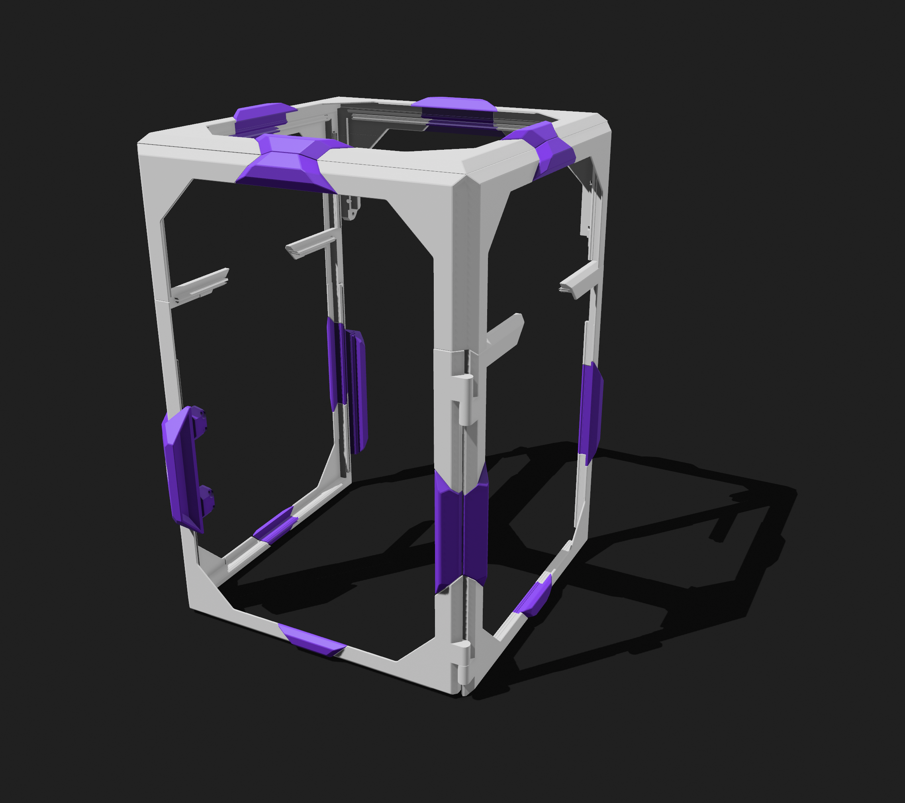
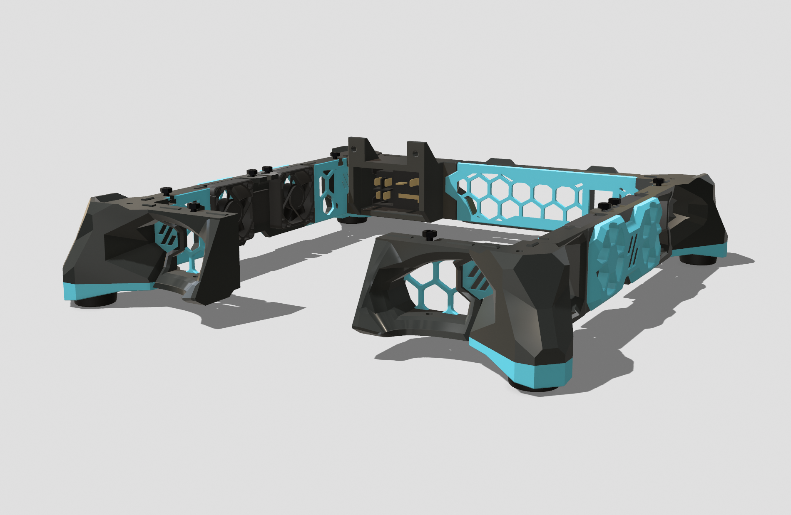
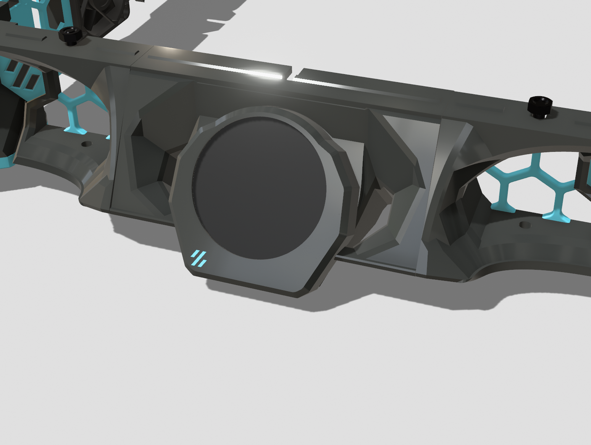
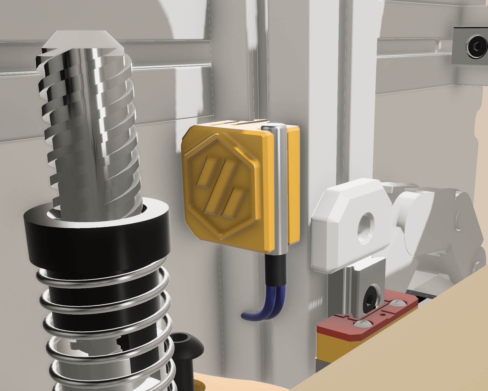

# My Collection of Mods for the Voron V0

Since I have so many different little mods for my Voron V0, I decided to put them all in one place.

> [!IMPORTANT]
> CAD source files are shared here to encourage remixing and collaboration.
> To access the ready-to-print models (STL/3MF), please visit the exclusive MakerWorld listings to help support my work.

## Mods

### Zero Armor – Full Body Panel Set for Voron V0.2

A full body panel set based on the ZeroV0Panels mod. (Which is based on ZeroPanels by zruncho3d)

[ZeroV0Panels - GitHub](https://github.com/MakerMylo/ZeroV0Panels/)
[ZeroPanels - GitHub](https://github.com/zruncho3d/ZeroPanels/tree/main)

The clips are surprisingly strong and hold the panels in place very well. I really liked the original design but wanted full coverage to give it a beefy look, so here it is.

[MakerWorld Listing](https://www.makerworld.com)

  

### Locking Stealth Door Handle

This one i remixed based on the [Stealth Door Handle](https://github.com/adooze/ZeroPanels_for_Stock_V0.2/blob/main/README.md) by [@adooze](https://github.com/adooze)
Really cool design but i wanted a locking handle.

[MakerWorld Listing](https://www.makerworld.com)

  

### Armored Stealth Skirts

Wider, bolder and beefier skirts for the Stealth Skirt mod. Redesigned legs, fan grill and back panel to match my Zero Armor.

  

### Knomi V2 Mount For Stealth skirts

A redesigned stealth skirt mount for the Knomi V2 Display.

  

### 1515 Clip-In Thermistor Mount

A stylish thermistor mount for the 1515 Extruder.

  

